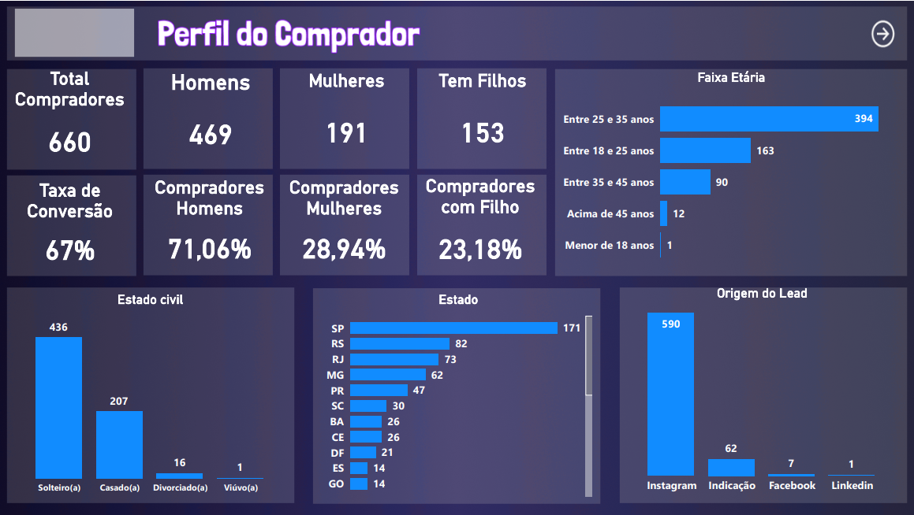

# Project: Mentee Profile and Career Potential Analysis Dashboard

### ➡️ Detailed Analysis and Interactive Dashboard in My Portfolio:
[Access the full project page here](https://ferreiragabrielw.github.io/portfolio-gabriel/projetos/Dashboards/11ProjetoPerfilMentorado/Projeto11DA.html)

---

## About the Project

This project presents an analytical Dashboard developed in **Power BI** to profile individuals interested in mentorship and career development. The objective is to provide a detailed view of demographic characteristics, education, experience, and aspirations, empowering the company to understand its audience, personalize offerings, and optimize resource allocation.

## Technologies and Process

*   **Tools**: Power BI Desktop (DAX, M), Figma (prototyping and design).
*   **ETL**: Data extracted from **four Excel files (`.xls`)**, transformed in Power Query, and modeled for multidimensional analysis.
*   **Key Insights**: Demographic and professional profile (25-35 years old, single, Instagram as main source), high demand for career migration (87.88%), available study time (2-4h), gaps in SQL/Project Management, and need for agile methodology training.

## Repository Content

*   `data/`: Four Excel database files (`BaseDadosGeral.xls`, `BaseDadosJaneiro.xls`, `BaseDadosMarco.xls`, `BaseDadosMaio.xls`) used.
*   `powerbi/`: Power BI dashboard `.pbix` file.
*   `figma/`: Files related to the prototype and design in Figma.
*   `quarto/`: `.qmd` file and its rendered HTML version.
*   `README.md`: This document.
*   `LICENSE`: Project license (MIT License).

## How to View

*   **Online**: [Access the published dashboard on Power BI Service](https://app.powerbi.com/groups/me/reports/33d5b95e-9fb9-47d2-8af1-a0eeaa0ded0d/ReportSection259bd8bfc3ddcb04fdf2?experience=power-bi)
*   **Locally**: Download the `.pbix` file from the `powerbi/` folder and open it with Power BI Desktop.

---

### License

This project is licensed under the [MIT License](LICENSE).
